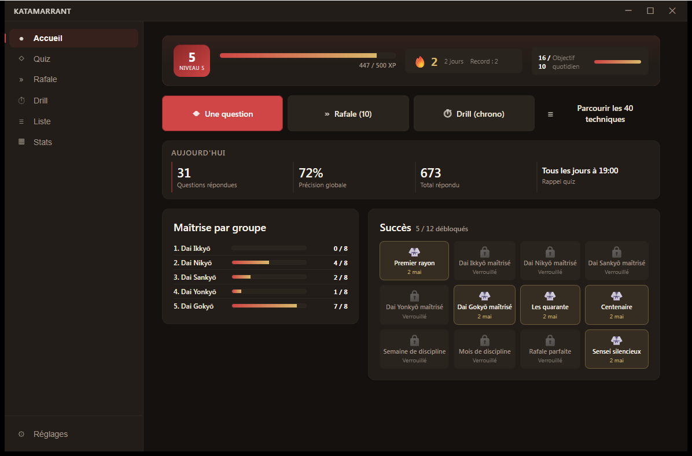
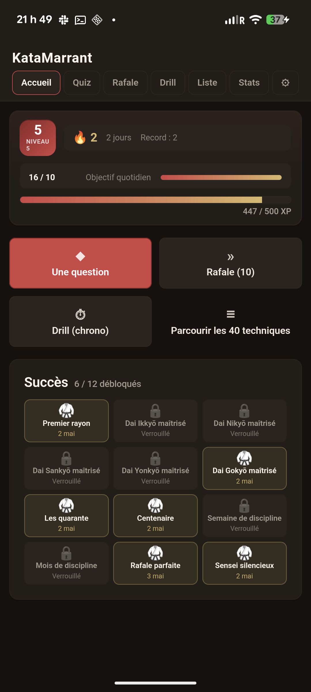
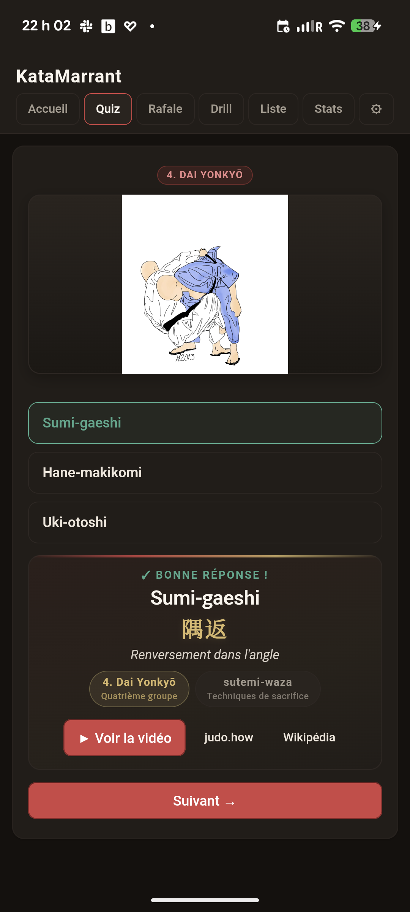
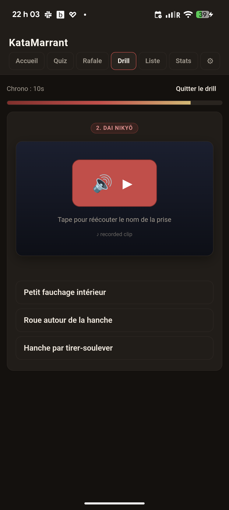
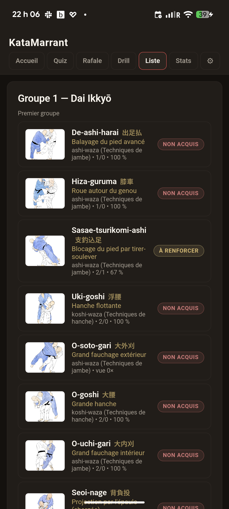

<p align="center">
  
</p>

<h1 align="center">KataMarrant</h1>

<p align="center">
  A small Tauri 2 trainer for the <strong>Gokyo no Waza</strong> — the 40 throwing
  techniques of judo grouped in five sets. Tap a video, pick the right name out of three.
</p>

<p align="center">
  <a href="https://github.com/Leicas/KataMarrant/releases"></a>
  <a href="https://github.com/Leicas/KataMarrant/actions/workflows/ci.yml"></a>
  <a href="https://github.com/Leicas/KataMarrant/actions/workflows/release.yml"></a>
  
  
  
  <a href="https://github.com/Leicas/KataMarrant/commits/main"></a>
  
</p>

| Desktop | Android |
|---|---|
|  |  |

## Modes

### Quiz — single question
The classic flow. The card shows an image of one of the 40 techniques and
three romaji choices. After you pick, the card reveals the romaji + kanji +
French translation together, plus links to the [judo.how](https://judo.how/)
reference video and the Wikipedia entry. One answer per session unless you
hit "Suivant".

### Rapid — 10-question burst
A timed run of ten consecutive questions. No reveal between answers — you
get a final scoreboard at the end with accuracy, response time, and a
breakdown of the slugs you missed. Great for daily warm-ups.

### Drill — chrono mode
Each question has a configurable time budget (default 10 s). Run out of
time and it counts as a miss. The drill view shows a countdown bar and
auto-advances. Audio mode replaces the image with a TTS clip of the
romaji name — same UI, ear-trained recall. Hit 10 in a row in audio mode
and the "silent sensei" achievement unlocks.

| Quiz | Drill (audio) | Liste |
|---|---|---|
|  |  |  |

## Features

- All 40 techniques across the 5 gokyo groups, each with a link to the
  [judo.how](https://judo.how/) reference video and the French Wikipedia entry.
- Image-first three-choice quiz: identify the technique from a picture, with
  romaji + kanji + French translation revealed together after each answer.
  Drop your own animated GIFs into `src/assets/illustrations/<slug>.gif` to
  upgrade from the built-in category silhouettes.
- Three modes:
  - **Quiz** — one prompt, scheduled or on demand
  - **Rafale** — 10 questions in a burst, scored at the end
  - **Drill** — chrono mode with a per-question time budget; audio mode swaps the image for a TTS clip
- Spaced-repetition weighting: weaker / unseen techniques surface more often.
- Configurable interval (5 min → 8 h, or off) — fires a notification on Android,
  an in-app prompt on desktop.
- Difficulty knobs: distractors from same group / same category / any, plus a
  hint-mode toggle that hides the kanji.
- Bilingue FR / EN — language auto-detected, switchable in settings. Each
  technique shows romaji + kanji + the literal French translation.

## Stack

Tauri 2 (Rust backend, vanilla JS frontend, no bundler), SQLite for stats,
`tauri-plugin-schedule-task` for Android background scheduling. Built so the same
codebase runs on desktop and on Android via `tauri android dev` / `android build`.

## Run it

```bash
npm install
npm run dev                  # desktop
npm run android:dev          # android (requires Android Studio + JDK)
```

## Adding katas later

Drop new entries in `src-tauri/src/data.rs`. The schema (`Technique`) covers slug,
romaji name, kanji, group, category, judo.how URL, wikipedia URL. Local
illustrations can be dropped in `src/assets/illustrations/` keyed by slug.

## Sources

- Gokyo list: [fr.wikipedia.org / Gokyo (judo)](https://fr.wikipedia.org/wiki/Gokyo_(judo))
- Reference videos: curated by [judo.how](https://judo.how/) — the "Watch video"
  button opens the YouTube clip embedded on each technique's judo.how page,
  and the `judo.how` button takes you to the source page itself.
- Illustrations: composite Gokyo poster on Wikimedia Commons (see
  [`src/assets/illustrations/ATTRIBUTION.md`](src/assets/illustrations/ATTRIBUTION.md)).
- Full credits: [`CREDITS.md`](CREDITS.md).
